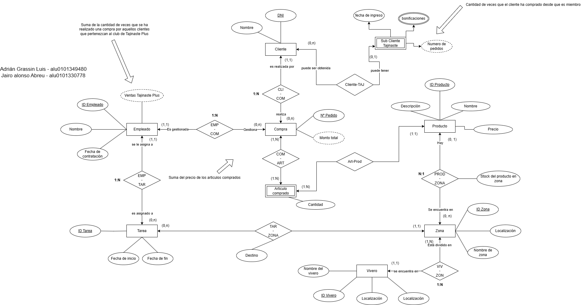
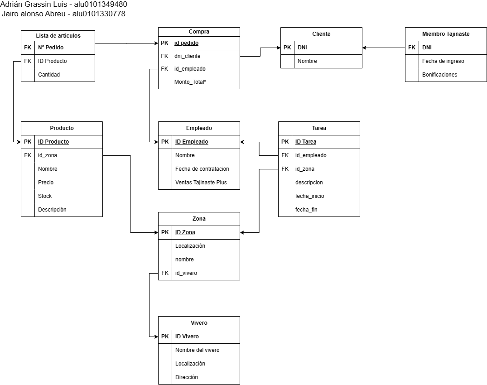
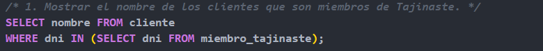
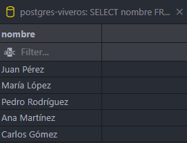
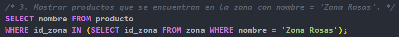
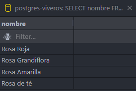
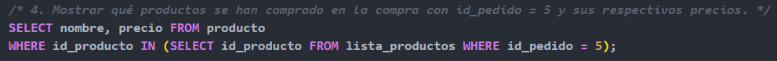
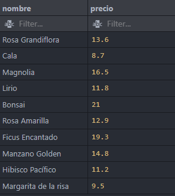

# ADBD - [MODELO RELACIONAL](https://docs.google.com/document/d/1k3u5NICoNoWP4uS252vJpxNns5uaNKF3kPII2v-pD-s/edit?usp=sharing) - VIVEROS

## ESQUEMA ENTIDAD RELACIÓN

> Las capturas mostradas a continuación se pueden encontrar en la carpeta img/ 


Este esquema ha sido modificado respecto a la anterior entrega debido a una serie de inconveniencias lógicas, que hacían poco favorable el paso al modelo relacional.

## TABLAS DEL MODELO RELACIONAL



## SCRIPT DE POSTGRESQL

> **archivo:** postgres-viveros.session.sql

### ENCONTRAMOS LA CREACION DE LAS TABLAS AL PRINCIPIO DEL FICHERO

```md
Se crean las tablas de:
  - Cliente
  - Empleado
  - Vivero
  - Zona
  - Producto
  - Miembro Tajinaste
  - Compra
  - Lista Productos
  - Tarea
```

#### A CONTINUACIÓN ENCONTRAMOS LAS INSERCIONES EN CADA TABLA. SE HA INTENTADO INSERTAR DE MANERA SIGNIFICATIVA, DE MANERA QUE PUDIESEN DARSE EJEMPLOS AL HACER CONSULTAS

```md
  - Cliente (10 inserciones)
  - Empleado (5 inserciones)
  - Vivero (5 inserciones)
  - Zona (25 inserciones, teniendo en cuenta los distintos viveros)
  - Miembro Tajinaste (5 inserciones)
  - Producto (25 inserciones)
  - Compra (5 inserciones)
  - Lista Productos (20 inserciones)
  - Tarea (6 inserciones)
```

### QUERYS REPRESENTATIVOS




- - -


- - -




- - -



